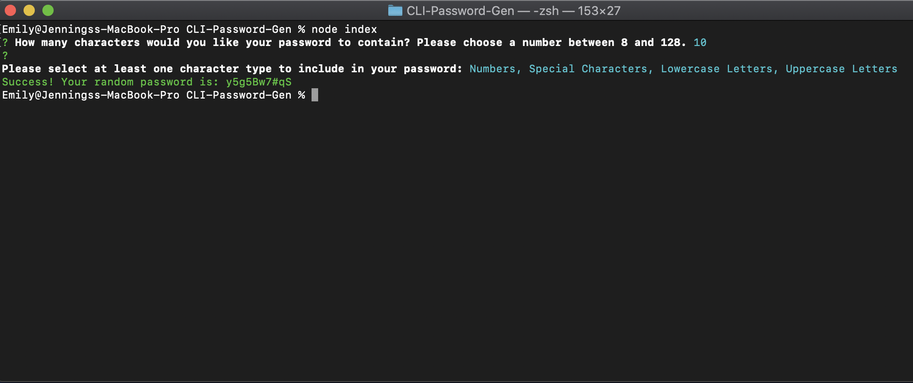

# Random Password Generator CLI

## Link: lalliere.github.io/password-generator/

## Project Description
Need a new password? This Password Generator will provide you with a strong, randomly generated password in seconds.

This application is a Command LIne Interface that uses Node, Inquirer, and ES6 classes.

The user will be prompted to choose from the following password criteria:
* Length (must be between 8 and 128 characters)
    * Application will alert you if invalid number of characters is chosen
* Character type (user selects each of the following character types that they wish to include):
    * Special characters
    * Numeric characters
    * Lowercase characters
    * Uppercase characters

The application will then provide the user with a randomly generated password consisting of the selected character types above and will display the new password on the terminal screen.

## Preview

## Got Questions? 
### Ask Me:
* GitHub Profile: https://github.com/lalliere
* My Email: emilylallier@yahoo.com